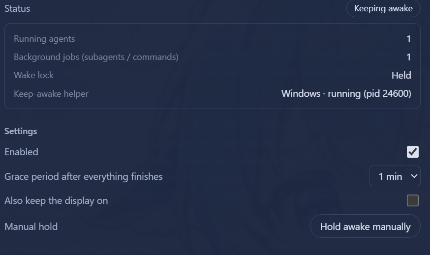

# dsh-keep-awake

<div align="center">

**Keep-awake plugin for the DeepSeek Harness (UI follows the DSH global language)**

Blocks OS sleep while any agent / subagent / background job runs · auto-release after a configurable grace period once idle · manual hold · optional display-on · Windows / macOS / Linux · persisted settings · multilingual web settings page

[](https://github.com/bearice/dsh-keep-awake)
[](LICENSE)
[](https://github.com/deepseek-ai/deepseek-harness)

**English** | [中文](README.md)

</div>

<div align="center">



</div>

## Features

| Feature | Where | Details |
|---|---|---|
| Live status | Settings → Keep Awake | Status badge (Keeping awake / Grace Ns / Standby / Disabled / Helper error), running agent count, background job count, helper platform + PID |
| Activity detection | — | Running agents (main agent / subagents / workflow children) + running background jobs (`run_in_background` commands / background subagent tasks) |
| Grace period | Configurable | Automatically releases keep-awake 15s–5m (default 60s) after everything finishes |
| Manual hold | Settings page | Force-keep awake regardless of activity; click to release |
| Keep display on | Optional | By default only system sleep is blocked (display may turn off); opt in to keep the display on too |
| Localization | Global | Follows the DSH global language (zh/en); auto-detects the browser/system language when unset; switches instantly (including the sidebar label) |

## How it works

Polls every 5 seconds, with instant re-scan on events (`agent/status`, `subagent/start|end`, job set changes):

- **Running agents**: agents with `status === 'running'` in `agents.list()` (covers the main agent, subagents, and workflow children)
- **Background jobs**: `running`/`stopping` jobs in `jobs.list()` / `jobs.list(agent)` (covers `run_in_background` commands and background subagent tasks)

When activity is detected, a platform helper process is started via the `subprocess` service (tree-level termination — the sleep flags release as soon as the process exits):

| Platform | Mechanism |
|---|---|
| Windows | PowerShell `SetThreadExecutionState(ES_CONTINUOUS \| ES_SYSTEM_REQUIRED)` (adds `ES_DISPLAY_REQUIRED` when "keep display on" is enabled) |
| macOS | `caffeinate [-d] -i -s` |
| Linux | `systemd-inhibit --what=idle --mode=block sleep 1e8` |

## Settings

Persisted in the profile's `settings.yaml` (namespace `keep-awake`):

| Key | Default | Description |
|---|---|---|
| `enabled` | `true` | Master switch |
| `graceMs` | `60000` | Grace period after all activity ends (15s–5m) |
| `preventDisplaySleep` | `false` | Also keep the display on |
| `manualHold` | `false` | Manual hold |

## Localization

The UI uses the framework `locale` service (namespace `keep-awake`, zh/en dictionaries): when no language is explicitly set, the browser/system language is used; switching in DSH's language settings takes effect instantly (both the settings page body and the sidebar label follow).

## HTTP routes (loopback)

- `GET /dsh-keep-awake/state` — current state (activity counts, helper process, config)
- `PUT /dsh-keep-awake/config` — update config, body `{ "section": {...} }`

## Install

```sh
# Inside the profile directory (e.g. ~/.dsh/profiles/web)
pnpm add "dsh-keep-awake@<source>"   # npm / github:bearice/dsh-keep-awake / link:<local path>
# and add "dsh-keep-awake" to dsh.profile.bundles in package.json
pnpm install
# restart the profile
```

## Development

- For local development, mount the package into the profile via `link:` (see Install above) and use `node --check lib/*.js` for syntax checks
- Layout: `lib/index.js` (Host), `lib/client.js` (web settings page), `cordis.patch.yml` (mount line)
